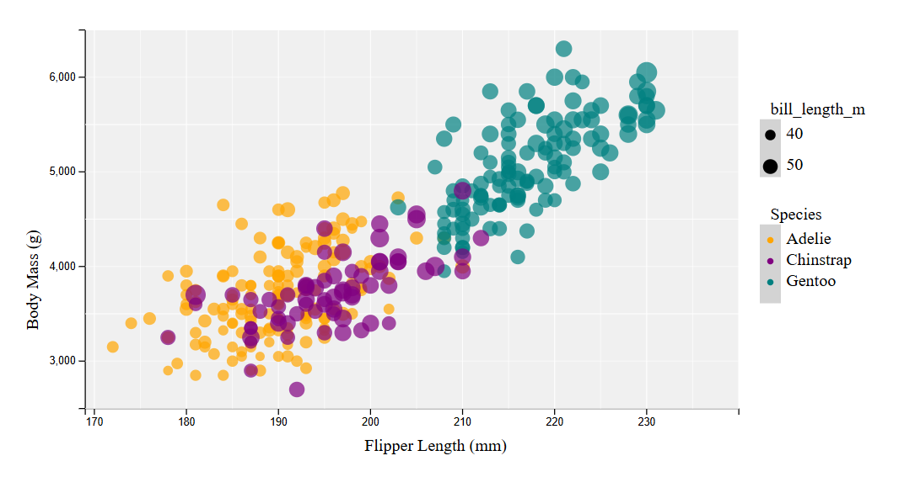
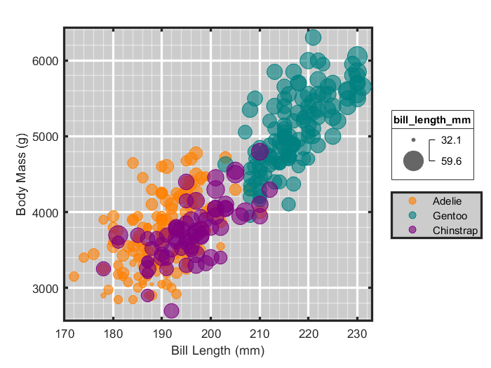
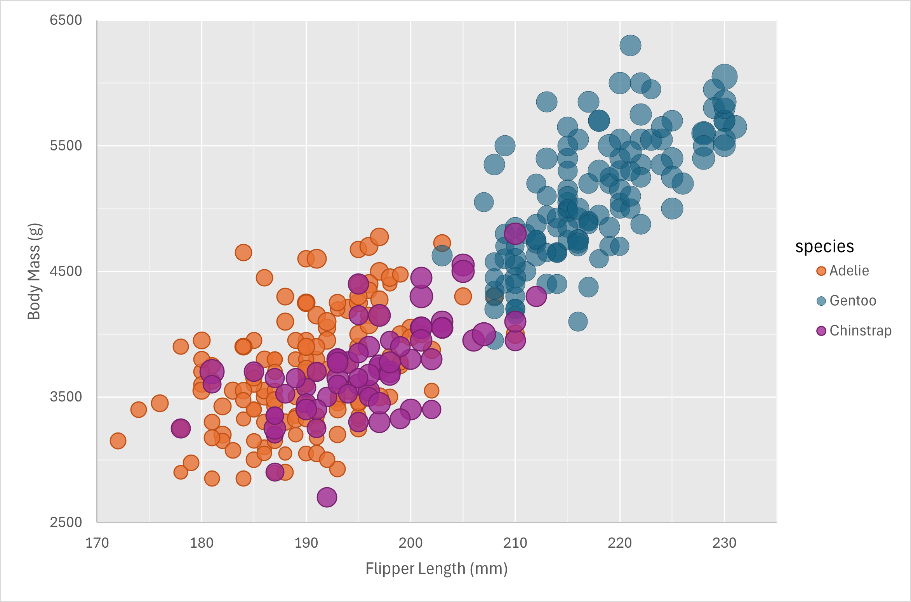
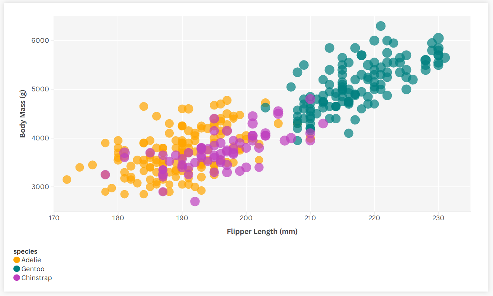
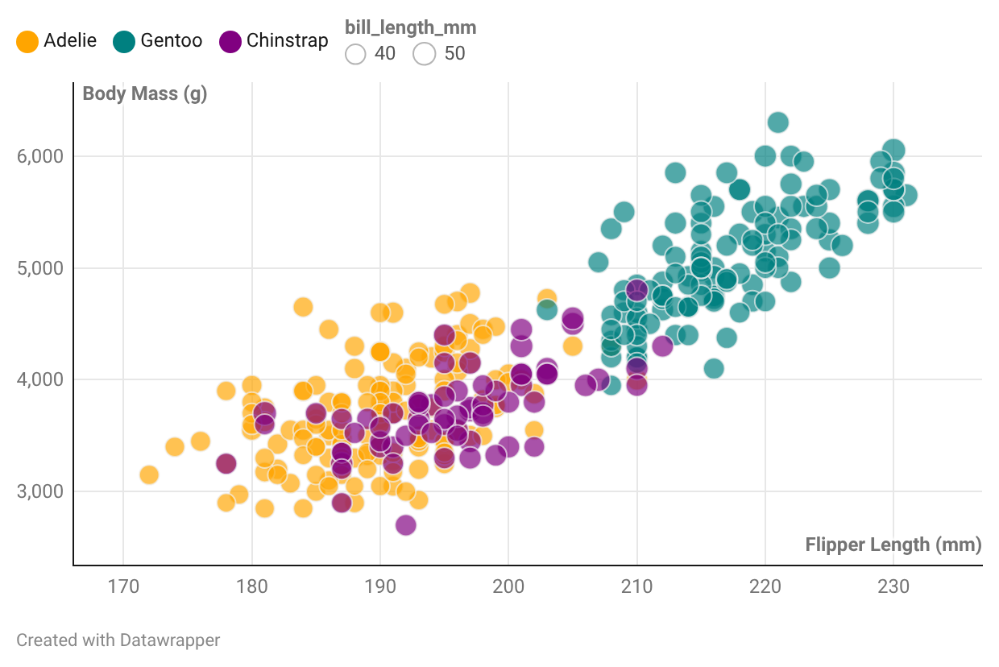

Holly Smith Assignment 2 - Data Visualization, 5 Ways  
===

I used these tools to create my visualizations:
1. d3
2. R + plotly
3. MATLAB
1. Excel
4. Flourish
2. Datawrapper

I didn't realize at first that I was nearing five visualizations and hadn't done three with programming languages. So, MATLAB was actually the sixth visualization I made, but I had already made the other five so I kept all six in!

# d3

My d3 visualization probably took the longest to make, since every part has to be created at a low level, but it was also one of the ones I most enjoyed creating. I feel like I had the most control over individual elements of my chart in d3, compared to other tools. I can see why d3 is so popular in the data visualization space, and I'd definitely use it again to create visualizations that I can get extremely close to my exact specifications. I feel like this was the only tool where I could implement every customization I wanted, and I think my final visualization is extremely close to the original one. I will definitely continue to use d3, not just for this course, but in the future.

# R + plotly

I really enjoyed making this visualization in R. I decided not to make it using ggplot, though, and instead used another library I found online called Plotly. I used ggplot in my statistics course a bit, so I wanted to try something else. I found great documentation and examples for Plotly, so it made the code to make the bubble chart easy to piece together.

The one big challenge I faced with this chart, however, was that I could not figure out how to make a legend for the bubble sizes. I looked through the plotly documentation for scatter charts and bubble charts, and could not find anything. So, I added a hover effect to my bubbles instead, which displays the bill length of the bubble the mouse is over, along with body mass and flipper length. 

<video controls src="img/Rplotlyhover.mp4" title="hover effect video"></video>

# MATLAB

Creating this bubble chart in MATLAB was a lot more difficult than I expected. A lot of the customizations I wanted to do were proving very hard to implement. For example, I had trouble creating a legend for the different bubble colors, because of how Matlab read the items as groups or not, I believe. I ended up splitting the penguin data into three different datasets, one for each penguin species, and plotting them on the same chart. This made creating the color legend a lot easier. I also had trouble being specific about how to make the bubble size legend, though it was simple to at least have a legend. The minor grid lines also proved difficult to specify how I wanted them laid out. Overall, I think I would only use MATLAB to make quick visualizations where I am not picky about the aesthetic features, as it was difficult for me to customize a lot of them. Luckily, though, MathWorks does have a lot of great documentation, so the attributes I could customize, I was able to find understandable documentation for. 

# Excel

Excel was the first place I made the visualization, because it is what I am most familiar with. I connected to my GitHub's csv link through Power Query, and also cleaned the data in Power Query by removing the penguins with null values and converting the columns I needed to numbers. I was able to create the visualization without using any references, because of my experience with Excel, except one time when I used CoPilot to figure out how to configure the series so I could change their colors. 

Excel has been and will continue to be one of my go-to visualization tools. I think it strikes a good balance between the intuitive tools of the platforms like Flourish and Datawrapper, and the customization ability of programming languages. There were certain parts I couldn't customize- for example, I couldn't find a way to add a bubble size legend- but overall I was able to achieve a lot of the features I wanted, like the grid lines, color scheme, and species legend. To compensate for the lack of a bubble legend, if you hover over any bubble, it will tell you the bill length associated with it.

# Flourish

This was my first time using Flourish, and I really liked how simple it was. I didn't have to use any outside resources to make this visualization, just the walk-through it gave me when I signed on. That being said, I did try to find outside resources to achieve other elements I wanted, specifically creating a legend for the bubbles and moving the species legend to the right-hand side, but could not; that level of customization does not seem possible. Luckily, though, Flourish automatically includes hover abilities, so viewers can tell the bubble size that way. However, I don't think it did a very good job scaling the bubbles, and I wish there were a setting for me to decide the scale manually. 
Overall, I liked how simple Flourish is- making the graph took me maybe five minutes, though I spent much longer trying to find ways to further customize- but I would not use it for anything where I wanted a higher level of customization. 

# Datawrapper

One of my favorite parts of Datawrapper was how simple it was to create a legend for the bubble sizes with my specifications- a bubble of size 40 and 50 mm- a task that was difficult or impossible in almost all of the other tools. However, getting other customizations was much harder; I couldn't change the background color, add minor gridlines, or move the legends to the right-hand side. Granted, I did not want to pay for a Datawrapper plan, and I'm guessing some of these features would've been available had I. Datawrapper got the job done on all the essential aspects of the chart I needed, but didn't allow for much further customization on the free plan, which I would have liked. Though simple to use, I'm unlikely to create in Datawrapper again, because of how limited customization is on the free plan. 

## Technical Achievements
- Used Power Query to connect to data in Excel. Power Query gave me greater capability to clean and prepare data in one place than if I simply duplicated the csv file and opened it as an Excel workbook.
- Used an R library unfamiliar to me in order to push myself to use a new tool. I had the technical capability to understand Plotly's examples and documentation, and apply what previous R knowledge I have to a new method.
- In MATLAB, I split the data set according to species, so I could improve how MATLAB displayed the color legend. I was able to layer all three of these datasets into one final visualization, still, with consistent scaling on both axes and bubble sizes. 
- In my d3 visualization, I used a for each JavaScript loop to cleanly create the species legend with equal spacing. 
- Also in d3, I used custom scales to make all three aspects of the bubbles proportional between the data and the visualization. I manually edited these scales to get the exact effect I desired. 
- I used style for the visualization I created in d3 by adding padding to the svg to make it appear cleaner in the internet window.

### Design Achievements
- Assured every visualization had a clear way to associate bubble size with bill length. Where I could, this meant a legend of bubble size. Where I couldn't make a legend, I used hover functionality so users could tell what bill length any bubble represented. 
- Put the legend on the right-hand side where possible, to keep consistent with original visualization (did this in d3, MATLAB, R, and Excel).
- Included minor grid lines wherever I could to ensure readability of flipper length and body mass of penguins (did this in d3, R, MATLAB, and Excel).
- Used a consistent color palette. In all six visualizations, orange means Adelie, purple means Chinstrap, and teal means Gentoo.

### Resources

**d3**
* https://d3-graph-gallery.com/graph/bubble_color.html
* https://d3js.org/d3-scale/ordinal 
* https://observablehq.com/@d3/scatterplot/2 
* https://d3js.org/d3-axis#axis_ticks 
* https://stackoverflow.com/questions/9329446/loop-for-each-over-an-array-in-javascript 

**plotly**
* https://plotly.com/r/bubble-charts/#styled-buble-chart
* https://plotly.com/r/reference/scatter/ 

**MATLAB**

* 	https://www.mathworks.com/help/matlab/ref/readtable.html
* 	https://raw.githubusercontent.com/hsmith1212/a2-DataVis-5ways-has/refs/heads/main/penglings.csv
* 	https://www.mathworks.com/help/matlab/creating_plots/change-tick-marks-and-tick-labels-of-graph-1.html
* 	https://www.mathworks.com/help/matlab/creating_plots/add-title-axis-labels-and-legend-to-graph.html
* 	https://www.mathworks.com/matlabcentral/answers/161664-how-do-i-set-a-background-color-in-plots
* 	https://www.mathworks.com/help/matlab/ref/grid.html
* 	https://www.mathworks.com/help/matlab/ref/matlab.graphics.axis.axes-properties.html#budumk7_sep_shared-GridLineStyle
* 	https://www.mathworks.com/help/matlab/ref/bubblesize.html
* 	https://www.mathworks.com/help/matlab/ref/bubblelegend.html#d126e149438

